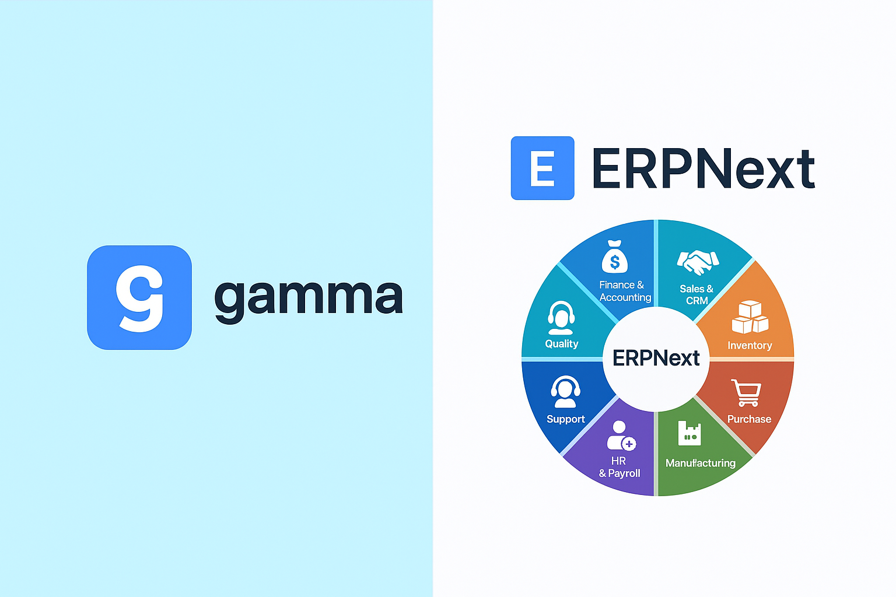

# Gamma Integration for Frappe/ERPNext

A powerful Frappe/ERPNext app that seamlessly integrates [Gamma.app](https://gamma.app) interactive presentations with your quotations, enabling you to create, manage, and embed dynamic proposals directly within your ERP system.



## 🚀 Features

### ✨ Core Functionality
- **Interactive Presentations**: Create and embed Gamma.app presentations directly in quotations
- **Dynamic Linking**: Automatic linking between Gamma Proposals and Quotations
- **Multiple Proposal Types**: Support for Main, Technical, Financial, Executive, Product Demo, and Case Study proposals
- **Real-time Sync**: Automatic synchronization of proposal data and status updates
- **Embedded Viewer**: View presentations directly within ERPNext interface
- **Custom Print Formats**: Professional quotation layouts with embedded Gamma proposals

### 🔧 Technical Features
- **Auto-linking**: New proposals automatically link to their quotations
- **Migration Support**: Existing proposals are automatically linked via database patches
- **API Integration**: RESTful API endpoints for external integrations
- **Error Handling**: Comprehensive error handling and logging
- **Permission Management**: Respects ERPNext permission system

## 📸 Screenshots

### Quotation with Gamma Tab

*Interactive Gamma proposals displayed directly in the quotation form*

### Gamma Proposal Management

*Comprehensive proposal management with status tracking and URL synchronization*

## 🛠 Installation

### Prerequisites
- Frappe Framework v14+ or ERPNext v14+
- Python 3.8+
- Node.js 16+

### Install via Bench

```bash
# Navigate to your bench directory
cd $PATH_TO_YOUR_BENCH

# Get the app from repository
bench get-app https://github.com/your-repo/gamma_integration.git

# Install the app on your site
bench --site your-site.local install-app gamma_integration

# Migrate to apply database changes
bench --site your-site.local migrate
```

### Manual Installation

```bash
# Clone the repository
git clone https://github.com/your-repo/gamma_integration.git apps/gamma_integration

# Install dependencies
bench setup requirements

# Install the app
bench --site your-site.local install-app gamma_integration
```

## 🎯 Usage

### Creating Gamma Proposals

1. **From Quotation Form**:
   - Open any quotation
   - Navigate to the "Gamma" tab
   - Click "Create Gamma Proposal" button
   - Fill in proposal details and Gamma URL
   - Save to automatically link to quotation

2. **Direct Creation**:
   - Go to Gamma Proposal doctype
   - Create new proposal
   - Link to existing quotation
   - Proposal automatically appears in quotation's Gamma tab

### Managing Proposals

#### Proposal Types
- **Main Proposal**: Primary presentation for the quotation
- **Technical Proposal**: Detailed technical specifications
- **Financial Proposal**: Cost breakdown and pricing details
- **Executive Summary**: High-level overview for executives
- **Product Demo**: Interactive product demonstrations
- **Case Study**: Success stories and use cases

#### Status Management
- **Draft**: Initial creation state
- **In Review**: Under internal review
- **Shared**: Shared with customer
- **Approved**: Approved by customer
- **Rejected**: Rejected by customer

### Gamma URL Integration

The app supports multiple Gamma URL formats:
```
https://gamma.app/docs/your-doc-id
https://gamma.app/embed/your-embed-id
https://gamma.app/public/your-public-id
```

All formats are automatically converted to embed URLs for seamless integration.

## 🔧 Configuration

### Custom Fields
The app automatically adds the following fields to Quotation:
- **Gamma Proposals Section**: Section break for organization
- **Gamma Proposals**: Child table for linked proposals
- **Proposals Display**: HTML field for embedded presentations

### Hooks Configuration
```python
# hooks.py
doc_events = {
    "Quotation": {
        "on_update": "gamma_integration.gamma_integration.doctype.gamma_proposal.gamma_proposal.sync_quotation_data"
    }
}
```

## 🔌 API Reference

### Create Gamma Proposal
```python
frappe.call({
    method: 'gamma_integration.gamma_integration.api.create_gamma_proposal',
    args: {
        quotation_name: 'QTN-2025-00001',
        proposal_name: 'Technical Proposal',
        proposal_type: 'Technical Proposal'
    }
})
```

### Get Quotation Proposals
```python
frappe.call({
    method: 'gamma_integration.gamma_integration.api.get_quotation_proposals',
    args: {
        quotation_name: 'QTN-2025-00001'
    }
})
```

### Link Existing Proposals
```python
frappe.call({
    method: 'gamma_integration.gamma_integration.api.link_existing_proposals'
})
```

### Refresh Gamma Display
```python
frappe.call({
    method: 'gamma_integration.gamma_integration.api.refresh_quotation_gamma_display',
    args: {
        quotation_name: 'QTN-2025-00001'
    }
})
```

## 🏗 Architecture

### DocTypes
- **Gamma Proposal**: Main proposal document with Gamma integration
- **Quotation Gamma Proposal**: Child table for linking proposals to quotations

### Key Components
- **Server-side Controllers**: Handle proposal creation, linking, and synchronization
- **Client-side Scripts**: Manage UI interactions and real-time updates
- **API Layer**: RESTful endpoints for external integrations
- **Migration Patches**: Ensure backward compatibility

### File Structure
```
gamma_integration/
├── gamma_integration/
│   ├── doctype/
│   │   ├── gamma_proposal/
│   │   └── quotation_gamma_proposal/
│   ├── patches/
│   ├── print_format/
│   └── api.py
├── public/
│   ├── js/
│   └── css/
├── fixtures/
└── hooks.py
```

## 🔄 Migration & Updates

### Automatic Linking
When upgrading from previous versions, run:
```bash
bench --site your-site.local execute gamma_integration.gamma_integration.patches.link_existing_gamma_proposals.execute
```

### Export Fixtures
To export current customizations:
```bash
bench --site your-site.local export-fixtures
```

## 🧪 Testing

### API Testing
Use the built-in test button in quotations:
- Navigate to any quotation
- Click "Gamma" → "Test API"
- Verify connection status

### Manual Testing
1. Create a new quotation
2. Add a Gamma proposal
3. Verify automatic linking
4. Check embedded presentation display

## 🐛 Troubleshooting

### Common Issues

**"No Gamma proposals linked" message**
- Run the linking patch: `bench --site your-site.local execute gamma_integration.gamma_integration.patches.link_existing_gamma_proposals.execute`
- Refresh the quotation form

**Proposals not displaying**
- Check Gamma URL format
- Verify embed ID extraction
- Check browser console for JavaScript errors

**Permission errors**
- Ensure user has read/write access to Gamma Proposal doctype
- Check quotation permissions

### Debug Mode
Enable debug logging in `site_config.json`:
```json
{
    "developer_mode": 1,
    "log_level": "DEBUG"
}
```

## 🤝 Contributing

We welcome contributions! Please follow these guidelines:

### Development Setup
```bash
cd apps/gamma_integration
pre-commit install
```

### Code Standards
- **Python**: Follow PEP 8, use ruff for linting
- **JavaScript**: Use ESLint and Prettier
- **Documentation**: Update README for new features

### Pre-commit Hooks
- ruff (Python linting)
- eslint (JavaScript linting)
- prettier (Code formatting)
- pyupgrade (Python syntax updates)

### Pull Request Process
1. Fork the repository
2. Create a feature branch
3. Make your changes
4. Add tests if applicable
5. Update documentation
6. Submit pull request

## 📋 Changelog

### v1.2.0 (Latest)
- ✅ Fixed dynamic linking issue for existing proposals
- ✅ Added automatic proposal linking on save
- ✅ Enhanced error handling and logging
- ✅ Improved client-side refresh mechanisms
- ✅ Added migration patches for backward compatibility

### v1.1.0
- Added multiple proposal types
- Enhanced UI/UX for proposal management
- Improved API endpoints

### v1.0.0
- Initial release
- Basic Gamma.app integration
- Quotation embedding functionality

## 🔐 Security

### Data Privacy
- No sensitive data is sent to Gamma.app
- All integrations use public embed URLs
- User permissions are respected

### Best Practices
- Regular security updates
- Input validation and sanitization
- Secure API endpoints

## 📞 Support

### Documentation
- [Frappe Framework Docs](https://frappeframework.com/docs)
- [ERPNext User Manual](https://docs.erpnext.com)
- [Gamma.app Documentation](https://gamma.app/docs)

### Community
- [Frappe Forum](https://discuss.frappe.io)
- [GitHub Issues](https://github.com/your-repo/gamma_integration/issues)

### Commercial Support
For enterprise support and customizations, contact: [your-email@company.com]

## 📄 License

MIT License - see [LICENSE](LICENSE) file for details.

---

**Made with ❤️ for the Frappe/ERPNext community**

*Transform your quotations with interactive Gamma presentations!*
